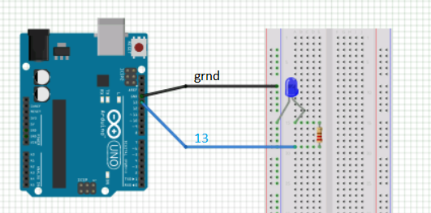

# TD1 : Initiation à Arduino
Pour compléter sans soucis ce TD, nous vous conseillons de vous munir des [diapos](https://rawgit.com/Anthagonas/arduino/master/docs/diapos.pdf) et de [l'aide mémoire](https://rawgit.com/Anthagonas/arduino/master/docs/aideMem.pdf) pour coder du C/C++ dans Arduino.

Créez un fichier `led.c` dans lequel vous écrirez le code.
## **Partie 1 : Allumage d'une LED**
Le but ici sera de faire clignoter une LED à intervalles précis. Cette LED est positionnée sur le broche _13_ de la carte Arduino.

Voici un schéma récapitulatif de la carte Arduino :

### **Mise en place de l'initialisation**
Pour faire clignoter la LED il faut d'abord indiquer à Arduino quelles sont les entrées/sorties utilisées par le programme.

Pour cela il faut :
1. Déclarer une variable globale correspondant à la LED.
1. Attribuer cette LED comme sortie.
### **Mise en place de la boucle principale**
Une fois les entrées/sorties définies, il faut déterminer le comportement général des éléments connectés à la carte Arduino. Nous désirons ici faire clignoter notre LED déclarée précédemment.

Pour faire clignoter la LED :
1. Provoquer l'allumage de la LED.
1. Marquer un temps d'arrêt dans l'execution du programme.
1. Demander l'extinction de la LED.

_**Note** : La fonction `loop()` se comporte comme une boucle, penser à marquer un temps d'arrêt supplémentaire entre l'extinction et l'allumage de la LED._

### **Pour aller plus loin**
Si vous vous sentez motivé, tentez de créer un signal S.O.S. avec votre LED !

Pour cela :
1. Créer une fonction `blinkS()` qui fait clignoter votre LED 3 fois lentement _(correspondant à la lettre S en morse)_.
1. Créer une fonction `blinkO()` faisant clignoter 3 fois votre LED rapidement _(correspondant à la lettre O en morse)_.
1. Utiliser les fonction `blinkS()` et `blinkO()` dans la fonction `loop()` afin de créer un S.O.S.

_**Note** : Il est nécessaire de marquer un temps d'arrêt entre chaque lettre en morse._

## **Partie 2 : Allumage de plusieurs LEDs**
Dans cette partie, la carte Arduino a été modifiée afin d'accueillir 3 LEDs. Les LEDs sont placées aux broches _11_,_12_ et _13_.

Voici un schéma de la nouvelle configuration :

Modifier le code précédent afin de :
1. Déclarer les nouvelles LEDs.
1. Modifier la fonction `setup()` afin de l'adapter à ce changement.
1. Modifier la fonction `loop()` afin de faire clignoter les LEDs une à une.

_**Note** : Si vous avez implémenté les fonctions `blinkO()` et `blinkS()`, vous pouvez tenter de faire correspondre à chaque LED une lettre du message S.O.S.
(On aura alors la première LED clignotant "S", puis la deuxième "O", puis la troisième "S")_

Vous trouvez ça nul de faire clignoter une LED? [**VOUS N'ETES PAS PRET!**](https://www.youtube.com/watch?v=6mXM-oGggrM)